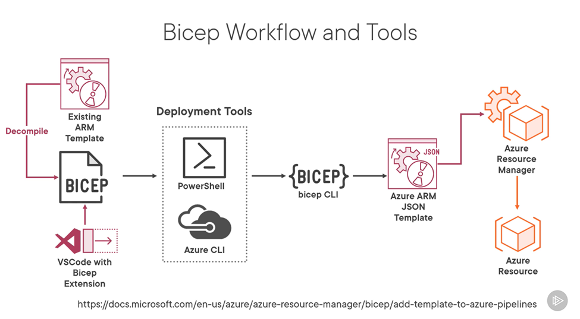

What is Bicep?

Bicep is a domain-specific language (DSL) that uses declarative syntax to deploy Azure resources. In a Bicep file, you define the infrastructure you want to deploy to Azure, and then use that file throughout the development lifecycle to repeatedly deploy your infrastructure. Your resources are deployed in a consistent manner. Bicep provides concise syntax, reliable type safety, and support for code reuse. Bicep offers a first-class authoring experience for your infrastructure-as-code solutions in Azure. Bicep can perform everything that an ARM template can, and then some. Whenever a new resource is introduced to Azure, Bicep supports it right away. Additionally, Bicep uses significantly less syntax than ARM templates.
----
Deploying Azure Bicep Templates using the Azure CLI

Step 1. Create a Bicep template or grab the one from the Microsoft Opensource Repo
vnet.bicep (lab00) is an example of a Bicep file that creates a virtual network with a single subnet.

Step 2. Sign in to your Azure Subscription
```shell
az login
```

Step 3. Create an Azure Resource Group (using the CLI) or identify the name of the resource group where you want your resources.
```shell
az group create --name <resource-group-name> --location <location>
```

Step 4. Deploy the Azure Bicep Template
```shell
az deployment group create --resource-group <resource-group-name> --template-file vnet.bicep
```