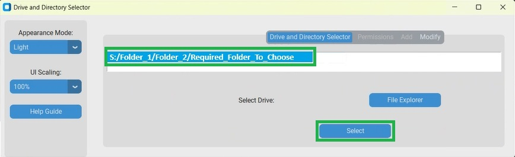
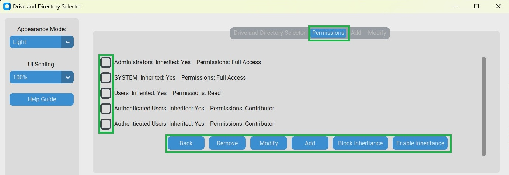

How to change file and folder permissions using the tool:
Note: You can only modify permissions for files and folders you have access to; some require administrative rights. 

To change file and folder permissions:  

1. Click Drive and Directory Selector Tab. 

2. Click File Explorer Button.  

 

3. File Explorer will open, Select Drive from the menu. 

4. Navigate to correct Folder and subfolder. 

5. Click Select.

6. Once correct Folder is selected, Click Permissions Tab. 

7. Select Required permissions using the Checkboxes, then click the Required Action from the Buttons.  

